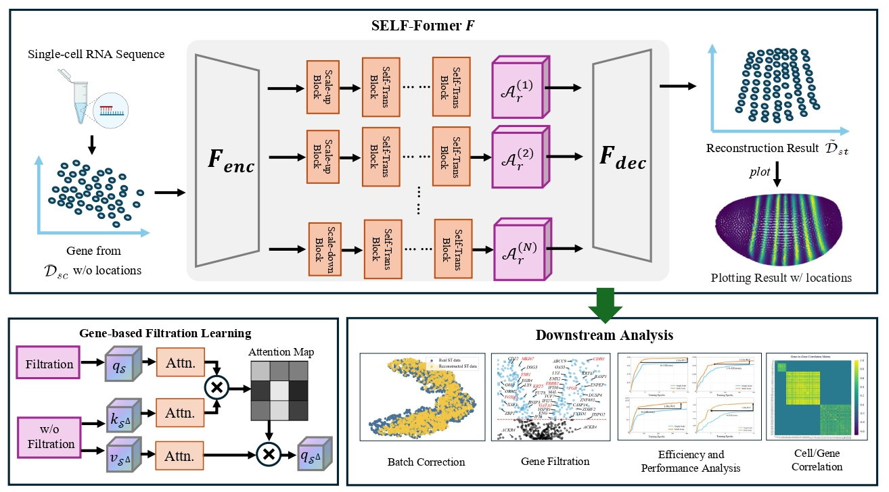

# SELF-Former: Multi-scale Gene Filtration Transformer for Single-cell Spatial Reconstruction
[![auc][aucsvg]][auc] 

[aucsvg]: https://img.shields.io/badge/SELF_Former-v1.1-orange.svg
[auc]: https://github.com/bravotty/DataMining_DecisionTree

We developed SELF-Former, a transformer-based framework that utilizes multi-scale structures to learn gene representations while designing spatial correlation constraints for the reconstruction of corresponding spatial transcriptomics (ST) data.

## Abstract
SELF-Former is a novel framework that leverages the power of transformers to capture multi-scale gene representations. By incorporating spatial correlation constraints, SELF-Former effectively reconstructs spatial transcriptomics data from single-cell RNA sequencing (scRNA-seq) data. This approach enhances the accuracy and resolution of spatial gene expression patterns, providing a valuable tool for spatial omics research.

## FlowChart


## Arguments
### SELF-Former

- In STARmap dataset, set hidden dimension to 2048, 1024, 1024, epoch to 400.
- In BRCA dataset, set hidden dimension to 8192, 4096, 4096, epoch to 100.

## How to Run
### Jupyter Notebooks
We provide training model code for STARmap and BRCA, as well as a tutorial for the visualization code.

### Evaluations Results
The specific resulet settings follow those in the 
We provide training code for the corresponding datasets, which can be used to validate the test results mentioned in [Spatial Benchmark](https://github.com/QuKunLab/SpatialBenchmarking) and obtain the corresponding Excel data. Additionally, we provide the corresponding test results at [ckpt Dropbox](https://www.dropbox.com/scl/fo/zej4p6bpdeod7cy1zyhlt/AAivuqIGXwrSap0ivaV1Yco?rlkey=rz2e1wl42dm7fhdxjh8g9pspn&st=hn1me3uc&dl=0) (metrics) and [ckpt Dropbox](https://www.dropbox.com/scl/fo/4lopmdwli7q2tnzxf0og2/ANFazSNg4e3odeuthAYoPu4?rlkey=fpkthdm88ouf18pt0bav8z77b&st=ofy4nx7s&dl=0) (reconstructed results).

### Environment Setup
Create and activate the conda environment, then install required packages:
```bash
conda create -n SELF-Former python=3.6
conda activate SELF-Former
pip install -r requirements.txt
